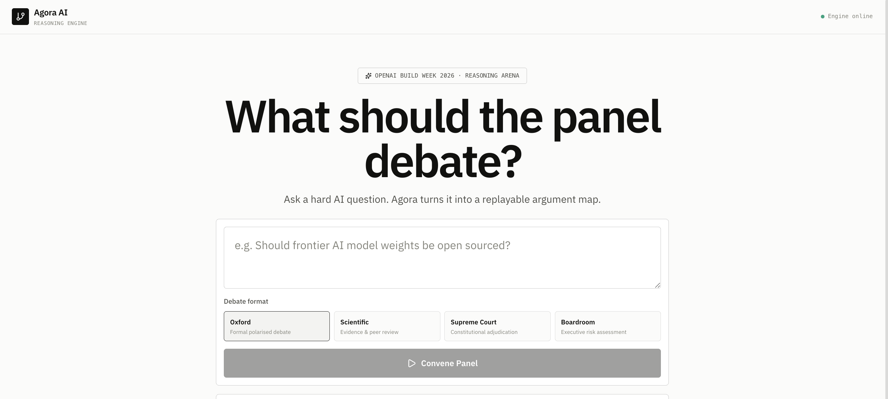

# Agora AI

Agora AI is a reasoning interface for high-stakes questions.

Instead of collapsing a difficult topic into a single chatbot response, Agora turns the question into a replayable argument artifact: a credential-weighted panel, a turn-by-turn debate trace, an argument graph, evidence leads, user interventions, and a final decision brief.

It was started during OpenAI Build Week, but the product direction is broader: Agora is designed as an inspectable decision layer for teams that need to understand how a conclusion was reached, where it was challenged, and what remains unresolved.

## Demo

Watch the current product demo:

[](assets/agora_ai_demo.mp4)

Open the video directly:

[assets/agora_ai_demo.mp4](assets/agora_ai_demo.mp4)

The demo uses the question:

> Should frontier AI model weights be open sourced?

This scenario was chosen because it creates a real policy and security tension: transparency and independent auditing versus misuse risk once model weights leave the control of the original lab.

## Why Agora Exists

Modern AI products are very good at producing answers. They are much weaker at showing the structure behind those answers.

For decisions about AI deployment, security, governance, product risk, law, medicine, or public policy, the answer alone is often not enough. A useful decision artifact should show:

- which claims were made,
- which claims were challenged,
- which assumptions carried the argument,
- where the strongest disagreement remains,
- what evidence should be inspected next,
- and how the conclusion changes when a perspective is removed or challenged.

Agora AI makes that reasoning visible.

## Core Product Idea

Agora treats reasoning as an object you can replay.

Each session produces:

- **Credential lenses** — domain perspectives such as safety, security, policy, economics, or law.
- **Argument graph** — each claim becomes a node, and each relationship is mapped as support, challenge, or revision.
- **Reasoning trace** — the debate can be paused, scrubbed, replayed, and inspected at any point.
- **Evidence leads** — compact references to frameworks, precedents, or research categories worth checking next.
- **Interventions** — the user can challenge a claim or inject evidence, causing new turns and graph updates.
- **Final verdict** — a decision brief with the strongest position, weakest assumption, unresolved disagreement, and next research question.

## What Makes It Different From ChatGPT

ChatGPT gives a synthesized answer. Agora externalizes the reasoning process.

The output is not just prose. It is a structured, replayable artifact:

- claims are separated from speakers,
- challenge relationships are explicit,
- revisions are visible,
- the final decision is linked to the debate trace,
- and the user can inspect how the system got there.

This makes Agora closer to a decision workbench than a chat interface.

## Current Experience

1. Start with a hard question.
2. Agora opens with a cinematic question-intake animation.
3. A panel of credential lenses is assembled.
4. Claims appear one at a time.
5. The argument graph grows as the debate unfolds.
6. The user can remove or restore perspectives.
7. The user can challenge the debate with a direct intervention.
8. The app produces a dedicated **Final Verdict** tab for the decision brief.

## Features

- **Curated replay mode** for reliable demos and repeatable evaluation.
- **OpenAI generation mode** when `OPENAI_API_KEY` is configured.
- **Turn-by-turn debate orchestration** with structured outputs.
- **React Flow argument map** with support, challenge, and revision edges.
- **Credential badges** instead of fictional expert personas.
- **Perspective filtering** to inspect the reasoning artifact with or without a lens.
- **Timeline scrubber** to replay the argument state.
- **Evidence lead cards** without pretending to have verified citations.
- **Intervention flow** for user-directed challenges.
- **Final Verdict tab** for a clean decision-board ending.
- **Demo-safe fallback** so the product still works without API keys.

## Demo Positioning

Agora’s demo mode is intentional. For a live product demo, reliability matters.

The app can run deterministic, curated sessions that show the product interaction clearly. The backend also supports OpenAI-powered generation for live debate sessions when an API key is provided.

The product does **not** claim that evidence leads are verified citations. They are presented as source directions: frameworks, precedents, or research categories to inspect next.

## Architecture

```text
agora-ai/
├── frontend/   # Next.js app, React Flow graph, replay UI
├── backend/    # FastAPI orchestration API
├── docs/       # Architecture and demo planning notes
├── assets/     # Demo video and project media
└── README.md
```

### Frontend

- Next.js
- React
- TypeScript
- CSS Modules
- React Flow

The frontend owns the product experience: prompt intake, cinematic intro, replay controls, panel filtering, graph visualization, intervention input, and the final verdict screen.

### Backend

- FastAPI
- Pydantic models
- OpenAI Responses API integration
- Deterministic demo-session fallback

The backend owns session generation, structured debate turns, intervention handling, and the final decision brief.

## Local Development

Requires Python 3.11+ and Node 18+.

### Backend

```bash
cd backend
python3 -m venv .venv
source .venv/bin/activate
pip install -r requirements.txt
cp .env.example .env
uvicorn app.main:app --reload --host 127.0.0.1 --port 8001
```

The backend runs on:

```text
http://127.0.0.1:8001
```

Leave `OPENAI_API_KEY` empty to use deterministic demo mode. Add an API key to enable OpenAI-generated sessions and interventions.

### Frontend

```bash
cd frontend
npm install
npm run dev
```

The frontend runs on:

```text
http://localhost:3000
```

Override the backend URL with:

```bash
NEXT_PUBLIC_API_BASE_URL=http://127.0.0.1:8001
```

## Validation

Frontend checks:

```bash
cd frontend
npm run typecheck
npm run lint
npm run build
```

Backend smoke check:

```bash
cd backend
source .venv/bin/activate
python -m compileall app
```

## Deployment Notes

- Deploy the frontend to Vercel or any Next.js-compatible host.
- Deploy the backend to Railway, Render, Fly.io, or a similar Python host.
- Set `NEXT_PUBLIC_API_BASE_URL` on the frontend to the deployed backend URL.
- Set `AGORA_CORS_ORIGINS` on the backend to the deployed frontend origin.
- Keep `OPENAI_API_KEY` optional so curated demo mode remains available.

## Product Philosophy

Agora is built around a simple belief:

> The future of AI decision-making is not just better answers. It is better reasoning artifacts.

For serious decisions, users should be able to replay, challenge, filter, and inspect the path to a conclusion.

Search engines organize information. Chatbots generate answers. Agora organizes reasoning.

## Origin

Agora AI began as an OpenAI Build Week project. The hackathon constraint helped sharpen the first workflow, but the project is intended to continue as a serious exploration of argument mapping, decision intelligence, and inspectable AI reasoning.

## License

MIT
